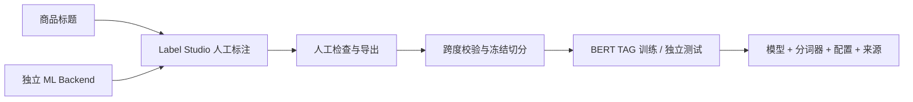
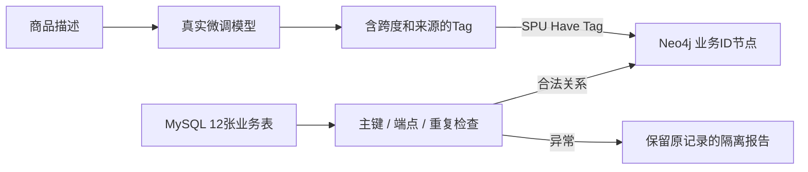
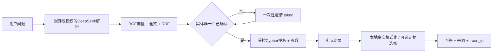
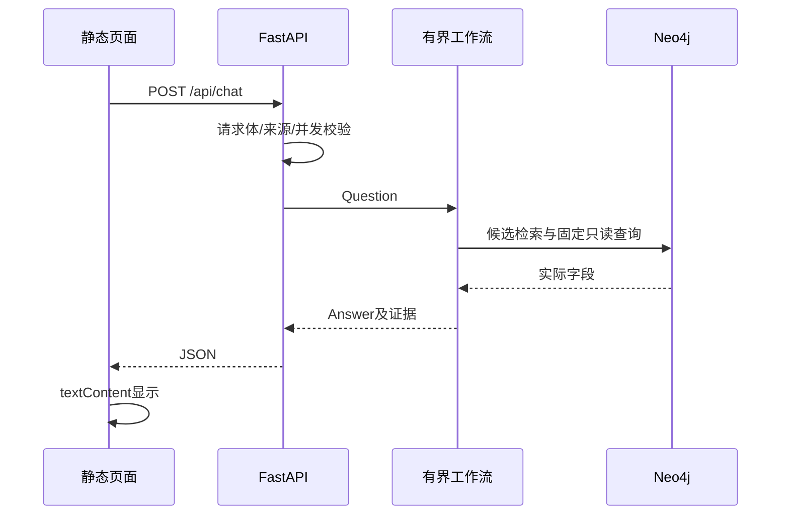
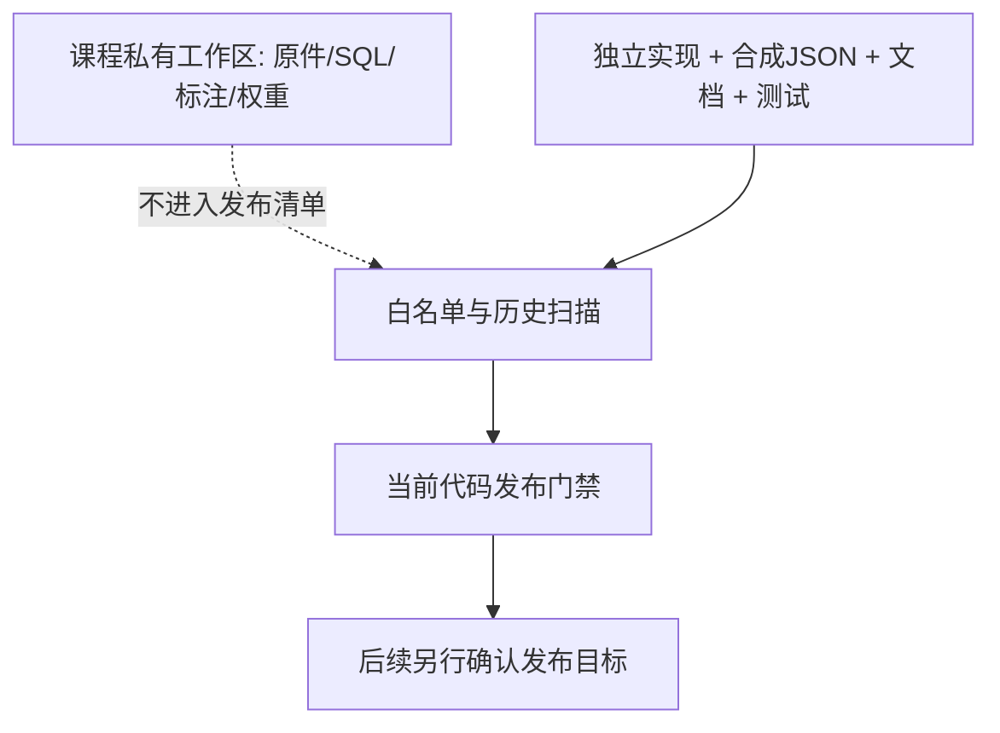

# 架构与数据边界

运行分为课程私有复现与独立公开示例。两者数据命名空间、端口、凭据和模型目录分离。公开页面以合成示例运行，默认没有在线 LLM。

Neo4j 使用固定 neo4j 数据库和数据集标记。服务模式检查实际只读状态；构建模式才允许同步。公共关系写入在事务中验证两端，失败回滚；运行接口不提供写操作。HTTP 同步工作放入线程，最多两个并发工作，请求与模型调用有超时。澄清存于单进程内存，有 TTL 和一次性消费，不是分布式会话系统。
