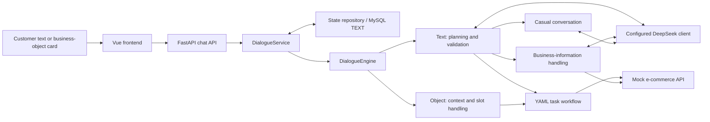

# E-commerce AI Customer Service

**A practical AI application for order enquiries and guided after-sales conversations.**

Python · FastAPI · LangChain · DeepSeek API · MySQL · YAML · Vue

This portfolio presents a course-based application the owner configured and ran.
It focuses on understanding e-commerce workflows, integrating services and checking
multi-turn interactions—not on building a model or a production customer-service platform.


| Business scenario | What the supplied application does |
|---|---|
| **Order enquiry** | Collects an order number or accepts an order card, then retrieves status from the mock commerce service. |
| **Logistics enquiry** | Uses an order number to retrieve carrier, tracking and delivery-progress information from that service. |
| **Refund conversation** | Collects an order number and refund reason, then generates a confirmation message. **The chat workflow does not create a refund request or transfer funds.** |
| **Multi-turn continuation** | Saves the workflow step and collected information as JSON-serialized text; subsequent messages load that state. |

**Preview scope:** authentic screenshots, source-grounded documentation and new
portfolio verification tools. Course application source is **not redistributed**
because permission was not established from the supplied materials. This package
runs a portfolio viewer, **not the underlying customer-service application**.

## Overview

A customer can type a question or send an order/product card. The backend loads
that sender's conversation state, plans a text message or interprets an object
card, and handles a task, a business-information query or casual conversation.
Order and logistics facts come from a **mock e-commerce API**; the configured
DeepSeek client supports planning and selected reply-generation paths. The
resulting dialogue state is saved for the next turn.

The owner's supplied configuration identifies `deepseek-chat` and DeepSeek's API
endpoint. Live model calls were **not repeated** during this review; credentials
were neither used nor included. The screenshots are evidence of the owner's
observed UI interactions, not an independent attestation of the provider.

## Demo: original running screenshots

All four images below are supplied by the owner, not generated or reconstructed.
Their business identifiers match the supplied mock fixtures. The Chinese interface
and response wording are preserved. These are not production customer records.

| View | Open the original screenshot | Evidence boundary |
|---|---|---|
| Home | [Home and order list](docs/assets/home.png) | UI and mock order objects. |
| Order status | [Order query](docs/assets/order-status.png) | Order-card input and a returned status. |
| Logistics | [Logistics query](docs/assets/logistics-query.png) | An order enquiry and returned tracking information. |
| Refund | [Refund dialogue](docs/assets/refund-dialogue.png) | Multi-turn collection and confirmation wording, **not a completed business refund**. |


The refund screenshot says the request was submitted. Source inspection shows
that this message is produced by a configured response action. The standalone
mock backend does have a refund-creation endpoint, but **this dialogue workflow
does not call it**. The image is retained as evidence; the limitation is not hidden.

See [screenshot provenance](docs/screenshots.md) and the
[original-byte manifest](docs/assets/manifest.json).

## Business flows and architecture



The API arrow from tasks applies to the **order and logistics lookups**, not the
refund confirmation flow. Object cards can bypass text planning. Some clarification
and response modes also use the model; not every step requires a model call.

[Architecture and API responsibilities](docs/architecture.md) ·
[Step-by-step business flows](docs/workflows.md)

## Dialogue state management

The state records the current workflow, step, collected fields, paused tasks,
focused order/product and conversation sessions. The repository reads it by
`sender_id`, deserializes it, and saves the updated state after a turn.

**Storage detail:** the `state_json` column is `TEXT`, containing JSON-serialized
state. It is not a native MySQL `JSON` column. A configured one-hour inactivity
window can reset runtime task context. The editable sender identifier is **not
an authentication mechanism**.

[State lifecycle and limits](docs/state_management.md)

## My implementation focus

The owner reports completing environment configuration, service integration,
DeepSeek configuration and the demonstrated order, logistics and refund-dialogue
runs. Supplied configuration and screenshots corroborate parts of that account.

The materials do **not** include an original baseline, commit history or a patch
that attributes the application architecture to the owner. Accordingly, this
portfolio does not claim the system was designed from scratch. Documentation,
packaging scripts and review tests were newly prepared with AI assistance for
this portfolio; they are not historical achievements of the original project.

[Contribution and evidence boundaries](docs/contribution_scope.md)

## Technical reading guide

Application files listed here are **reference paths in the separately supplied
source**, not bundled files or working links to a public repository.

| Start here | Original source entry |
|---|---|
| Model configuration and integration | `customer-service-backend/atguigu/infrastructure/llm.py` |
| Message planning and dispatch | `customer-service-backend/atguigu/engine/dialogue_engine.py` and `planning/planner.py` under the same `atguigu` package |
| Three business workflows | `customer-service-backend/flow_config/user_flows.yml` |
| State persistence | `customer-service-backend/atguigu/repository/dialogue_repository.py` |
| Actual business API boundaries | `ecommerce-service-backend/app/api.py` |

The [code navigation guide](docs/code_navigation.md) gives line ranges and what to
check. It also identifies the difference between implemented product/order API
retrieval and the unimplemented FAQ/RAG providers. No RAG, native tool calling,
model training or production authentication capability is claimed.

## Quick start — portfolio only

No API key, database or third-party package is needed. These commands were
executed with **Python 3.13.5**, from this directory:

```bash
python -B tools/verify_preview.py
python -B tools/build_preview.py
python -B -m unittest discover -s tests -v
```

Open `index.html` in a browser. It is a static portfolio document embedding the
original screenshot bytes, with no external fonts, scripts, tracking or API calls.
It is **not an interactive customer-service backend**.

The underlying application startup has not been verified here with MySQL and a
live DeepSeek account. A validated full-application Quick Start is therefore not
provided. [Configuration notes](docs/configuration.md) describe only settings
found in source. The blank `.env.example` is a reference, not a working deployment.

## Validation and limitations

| Evidence | Status |
|---|---|
| Four original screenshots | Reviewed and hash-checked; owner-provided running evidence. |
| Source audit | 99 nonsecret text files read; lock metadata and credential presence checked separately. |
| Controlled source checks | **13 tests passed** using temporary SQLite, in-process HTTP, fixed commands and a static-response test double. |
| Frontend source | Vue single-file component parse/script/template/style checks passed; no full Vite build or service-integrated browser run. |
| New portfolio tools | Tested separately; they validate packaging, not AI accuracy. |
| MySQL / live DeepSeek / end-to-end app | **Not runtime-verified in this review.** |
| Course-source redistribution | **Permission not established; source withheld.** |

The controlled tests do not execute the live planner, original LangChain response
chain or MySQL server. They do not measure latency, accuracy, coverage, workload
reduction or conversion uplift. [Validation detail](docs/validation_status.md)

## Project structure

```text
.
├── README.md
├── NOTICE.md
├── THIRD_PARTY_RELEASE_AUDIT.md
├── PUBLIC_RELEASE_CHECKLIST.md
├── .env.example                 # Empty reference settings only
├── requirements.txt             # No portfolio dependencies
├── index.html                   # Static portfolio, not the original app
├── tools/                       # New portfolio integrity / HTML tools
├── tests/                       # New packaging tests
└── docs/                        # Source-grounded explanations and original images
```

## Source and release status

The implementation is based on the **Atguigu (尚硅谷) “电商小二” course project**.
No project-level redistribution license was found in the supplied archive.
Attribution is retained; attribution alone is not treated as permission.

This repository is an **owner-authorized public portfolio release**. The complete
course application source is intentionally excluded because no project-level
redistribution license was found in the supplied archive. The included screenshots
were supplied by the owner for portfolio demonstration; third-party rights were not
independently verified. See the [release record](PUBLIC_RELEASE_CHECKLIST.md) and
[third-party release audit](THIRD_PARTY_RELEASE_AUDIT.md) for scope and limitations.

[Third-party release audit](THIRD_PARTY_RELEASE_AUDIT.md) · [Notice](NOTICE.md)
