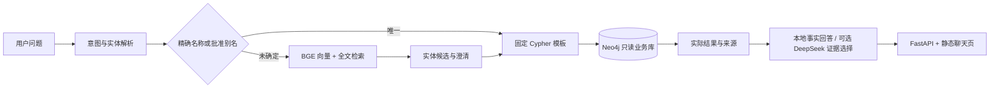
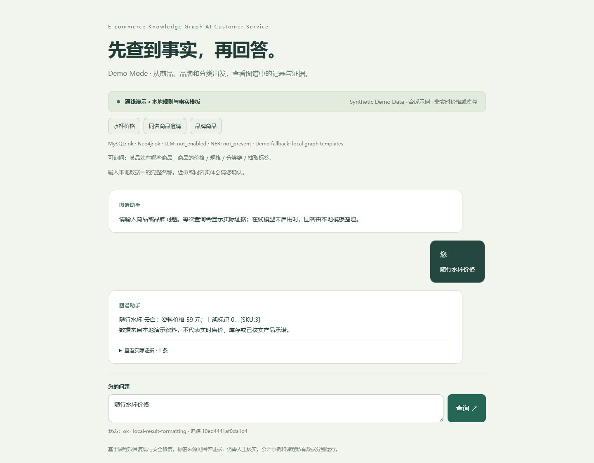

# E-commerce Knowledge Graph AI Customer Service

电商知识图谱 AI 客服：基于课程项目二次开发的、可核查证据的本地作品集项目。

商品问题先确定意图和实体，再执行固定图查询；回答展示实际数据库证据。公开数据全部是独立编写的 **Synthetic Demo Data**。默认无需付费模型 API，BGE 在本机运行。





[Windows 从零启动](docs/GETTING_STARTED_WINDOWS.md) · [演示步骤](demo.md) · [验证报告](release_validation.json) · [来源与个人改动](SOURCE_MAP.md) · [英文介绍](README_EN.md)

## 能做什么

|能力|实现与边界|
|---|---|
|人工标注与 AI 预标注接口|Label Studio 与独立 ML Backend；无已授权在线服务时明确阻塞预标注，不返回假预测|
|BERT TAG|数据校验、原文跨度对齐、去重切分、训练、保存、预测和独立测试入口；公开版本未完成正式训练|
|结构化同步|MySQL 12 表映射为 10 类结构节点；端点校验、事务写入、重复导入与对账|
|文本入图|SPU–Have–Tag 带原文摘要、跨度和模型来源；公开 Tag 为人工合成示例|
|混合检索|BGE 512 维向量 + Neo4j 中文全文，RRF 合并候选，保留业务身份和来源|
|实体对齐|唯一精确名称/登记别名直接使用；同名和模糊候选需澄清|
|受控问答|9 个固定 Cypher 模板、参数边界、超时、数据库只读、证据回答|
|应用验证|FastAPI、原生 HTML/CSS/JS、真实数据库集成、浏览器故障测试、关闭重启验证|

示例只有 3 个 SPU，故意包含两个同名商品；它用来复现边界和调用链，不代表生产规模。图生成规则为 21 个结构节点、27 条结构关系，加 4 个人工 Tag 与 4 条 Have；实际查询记录见验证报告。

## 快速启动

Windows PowerShell 中先进入空间充足的开发目录，再执行。需要 Git 和 Python 3.12；首次安装会下载 CPU PyTorch、BGE、JDK 和 Neo4j，至少预留 12 GiB。不安装 WSL，不覆盖其他环境。

```powershell
git clone https://github.com/gretchenrohrscheib426-droid/ecommerce-ai-customer-service.git
Set-Location ecommerce-ai-customer-service
$basePython = (py -3.12 -c "import sys; print(sys.executable)").Trim()
& $basePython -X utf8 scripts/check_environment.py
powershell -NoProfile -ExecutionPolicy Bypass -File scripts/public_bootstrap.ps1 -Python $basePython
& .\.venv-public\Scripts\python.exe scripts/services.py start neo4j
& .\.venv-public\Scripts\python.exe scripts/sample_demo.py secure
& .\.venv-public\Scripts\python.exe scripts/sample_demo.py build
& .\.venv-public\Scripts\python.exe scripts/create_indexes.py
& .\.venv-public\Scripts\python.exe scripts/serving_mode.py serve
& .\.venv-public\Scripts\python.exe scripts/services.py start api
Invoke-RestMethod http://127.0.0.1:8012/health/ready
```

健康接口返回 ready 后，打开 http://127.0.0.1:8012。初始化只做一次；日常 `scripts/run_demo.py start` / `stop` 不重新安装或导入。端口冲突、Python 没有 py 启动器、不同终端及完整 MySQL 路线见 Windows 文档。

## 可以现场演示的问题

|问题|观察点|
|---|---|
|青岚品牌有哪些商品|品牌别名、真实商品列表|
|随行水杯价格|价格 59、未上架状态也明确显示|
|随行水杯规格|属性值来自图查询|
|随行水杯分类链|三层分类路径|
|随行水杯标签|人工合成 Tag 来源标记|
|随行水杯信息|商品详情|
|轻旅背包价格|同名商品澄清，再选择一个业务 ID|
|zxqv998877|无匹配，不补造商品|
|查看订单|能力边界，拒绝未实现的订单查询|
|删除所有节点|拒绝写入，HTTP 不暴露原始 Cypher|

## 工程与验证

Python 3.12、FastAPI、Pydantic、PyMySQL、Neo4j 5.26、Transformers、PyTorch CPU、Sentence Transformers；前端没有构建工具或过时 CDN 依赖。Agent 在这里指单个有界工具工作流，不声称多智能体或模型原生工具调用。

```powershell
& .\.venv-public\Scripts\python.exe -m pip install -r requirements-dev.txt
& .\.venv-public\Scripts\python.exe -m pytest tests/unit tests/e2e/test_api.py -q
& .\.venv-public\Scripts\python.exe scripts/public_verify.py --restart
& .\.venv-public\Scripts\python.exe scripts/validate_release.py --run
```

单元/API mock、真实数据库、真实浏览器、随机小模型训练接口检查、正式训练和在线模型调用分别记录。详见 [验证说明](docs/VALIDATION.md)。GitHub Actions 自动运行离线合同测试、清单/历史边界检查和完整锁定依赖的漏洞扫描；运行链接以 GitHub 实际结果为准。

## 来源、贡献与限制

课程提供电商图谱、标注、BERT 与检索问答的学习主线。个人新增及修复包括原文跨度恢复、分词器保存、稳定图身份、索引幂等、实体 metadata、固定模板查询、防注入与澄清、独立样例、测试和发布审查，逐项映射见 [SOURCE_MAP](SOURCE_MAP.md)。MIT 仅覆盖本仓库有权公开的代码与独立样例，上游软件许可独立保留。

正式 BERT 训练、该修订的独立测试 F1、真实 AI 预标注、DeepSeek 在线回答均未验证。没有权重和课程原件随仓库分发。源码公开不代表网站已部署；本项目默认仅本地演示。简历只能采用本人能解释、且有对应证据的表述，见 [RESUME_EVIDENCE](RESUME_EVIDENCE.md)。
