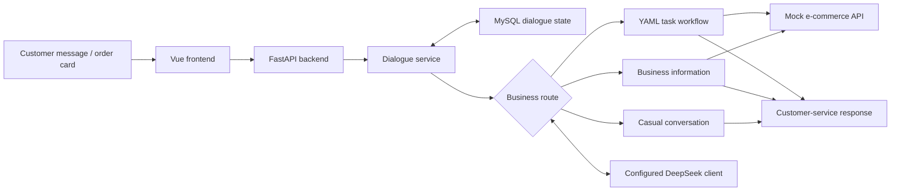

# E-commerce AI Customer Service

**A course-based AI customer-service application that I configured, integrated and tested across common e-commerce scenarios.**

**Tech Stack:** Python · FastAPI · LangChain · DeepSeek API · MySQL · YAML · Vue

> Portfolio scope: this public repository documents my environment setup, service integration and business-flow validation. The complete course source is not redistributed because no project-level redistribution license was identified in the supplied materials. Real API keys and database credentials are not included.

## What I validated

| Scenario | What the application does |
|---|---|
| **Order enquiry** | Collects an order number or order card and returns order status from a mock e-commerce service. |
| **Logistics enquiry** | Retrieves carrier, tracking number and delivery progress for a mock order. |
| **Refund conversation** | Collects order number and refund reason, then returns confirmation wording. The chat workflow does **not** create a real refund or move funds. |
| **Multi-turn continuation** | Saves workflow progress and collected information so the next message can continue the same task. |

## Application flow



The diagram is a documentation summary of the supplied source. Not every request uses every component.

## My implementation focus

- Completed the project environment configuration and service integration needed for the demonstration.
- Configured the DeepSeek-compatible model client and verified the application flow through the running interface.
- Ran and checked **order status, logistics and refund-information collection** scenarios using mock business data.
- Reviewed how the application stores workflow progress and collected fields for multi-turn continuation.
- Kept the public portfolio separate from the course implementation and removed credentials/private configuration.

I do **not** claim to have designed the entire course architecture from scratch. This repository is intended to show practical AI-application integration and business-process understanding.

## Dialogue state

The supplied application stores a serialized dialogue state keyed by `sender_id`. The state includes the current workflow step and collected fields, allowing a later message to continue an unfinished task. In the supplied implementation, JSON content is stored in a text field rather than a native MySQL JSON column.

See [Dialogue state notes](docs/state_management.md).

## Business workflow notes

The three demonstrated flows are documented in [Core business workflows](docs/workflows.md). The refund flow is deliberately described as a **confirmation-only conversation** because the chat workflow does not call the standalone mock refund-creation endpoint.

## DeepSeek configuration

Only placeholder configuration is provided publicly:

```env
LLM_MODEL=
LLM_BASE_URL=
LLM_API_KEY=
COMMERCE_API_BASE_URL=
DATABASE_URL=
APP_HOST=
APP_PORT=
```

A real `.env`, API key, database password, token, cookie or private path must never be committed.

See [Configuration notes](docs/configuration.md).

## What is intentionally not public

- Real DeepSeek API key or other credentials
- `.env` files and database passwords
- Complete Atguigu course source
- Course prompts, YAML files, SQL seeds and Docker configuration
- Unverified RAG / vector-database / tool-calling claims
- Production customer data or production refund capability

## Source and attribution

The application is based on the **Atguigu (尚硅谷) “电商小二” course project**. No project-level redistribution license was found in the supplied archive, so this repository does not republish the full implementation. Attribution is retained rather than presenting the course architecture as wholly original work.

See [NOTICE](NOTICE.md) and [third-party release audit](THIRD_PARTY_RELEASE_AUDIT.md).

## Repository structure

```text
.
├── README.md
├── .env.example
├── .gitignore
├── NOTICE.md
├── THIRD_PARTY_RELEASE_AUDIT.md
└── docs/
    ├── architecture.md
    ├── workflows.md
    ├── state_management.md
    ├── contribution_scope.md
    └── configuration.md
```

## Resume-friendly summary

> Configured and integrated a course-based e-commerce AI customer-service application with DeepSeek API support, and validated order-status, logistics and refund-information collection flows; reviewed MySQL-backed conversation-state persistence for multi-turn continuation.
