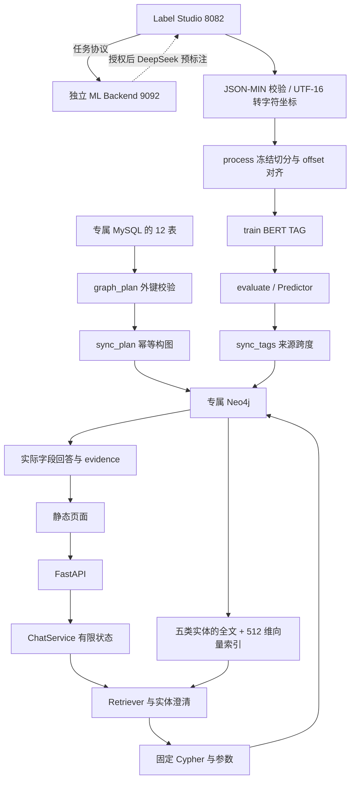

# 实际模块关系

课程私有实例与独立公开示例使用不同数据目录和端口。公开样例直接由 12 表形状的独立 JSON 建图，人工 Tag 夹具明确标注；公开版本已从专属 MySQL 实际同步；正式训练与在线调用未验证，不继承旧版成绩。

`Settings` 只解析配置；`schema.py` 定义输入/计划；`Predictor` 做已训练模型推理；`sync_plan` 对应 TableSynchronizer；`sync_tags` 对应 TextSynchronizer；`create_indexes` 构建检查索引；`Retriever` 返回结构化 metadata 并拒绝擅自选择模糊首项；`ChatService` 控制最多六个步骤。

原课程依赖 LangChain 的部分流程在本实现中用类型 schema、官方驱动和 httpx 显式重写，保留业务链路并缩小动态查询能力；安装了集成依赖不等于实际采用了其 Agent。未使用 LangGraph、CrewAI、MCP、多智能体或自主工具选择。
