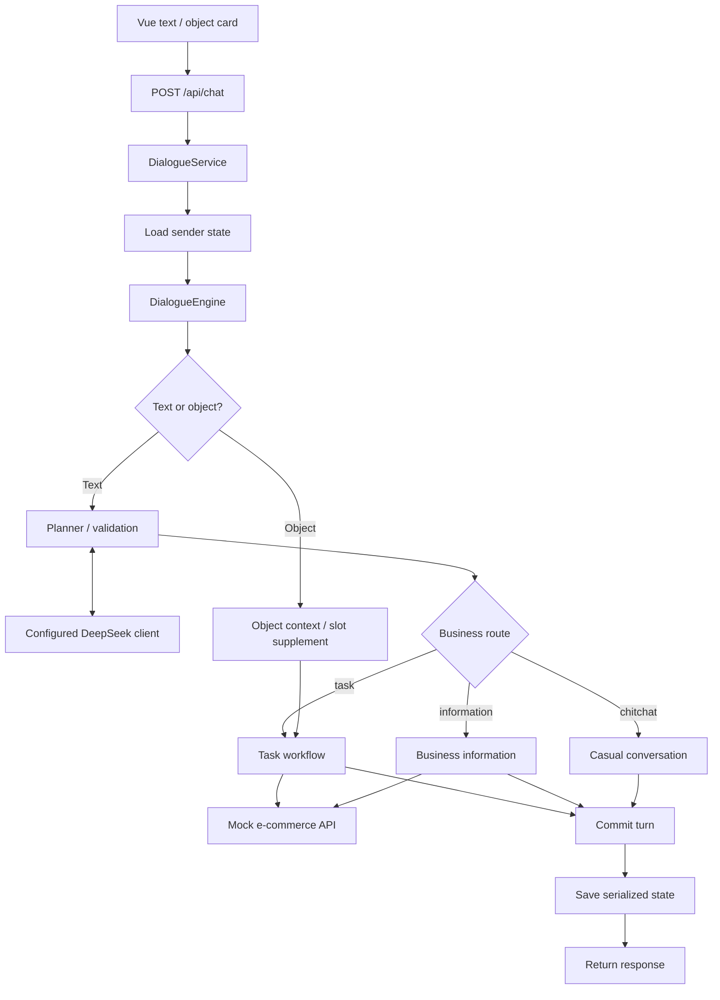

# Architecture grounded in the supplied source

## Component responsibilities

| Component | Actual responsibility |
|---|---|
| Vue frontend | Text input, sender identifier, history and order/product cards. |
| FastAPI customer-service backend | Chat/history HTTP interface and per-turn orchestration. |
| DialogueService | Load state, run the engine, save state. |
| DialogueEngine | Text planning/validation, object handling and task/information/chitchat dispatch. |
| LangChain model client | OpenAI-compatible transport configured for the owner's DeepSeek endpoint. |
| YAML task executor | Follow configured steps, collect required fields and run registered application actions. |
| Mock commerce service | Read seeded orders/products/logistics; it also exposes standalone reminder/refund endpoints. |
| MySQL state repository | Store JSON-serialized dialogue state as text. |

## Message path

The arrows summarize source paths; not every request visits every node. Object handling can avoid text planning. The refund task uses a response action rather than the standalone commerce refund-write endpoint.

## Claims intentionally excluded

The supplied material does not support public claims of production authentication, real funds movement, measured business KPI improvements, native model tool-calling, or a completed vector/RAG stack. Those are intentionally omitted.
