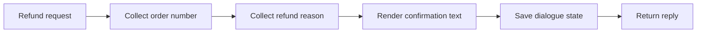

# Core business workflows

This portfolio highlights the three scenarios demonstrated by the owner. The complete course YAML is intentionally not republished.

## 1. Order-status query

The workflow collects an `order_number`, calls the mock order-detail/status path and returns the result. An order card can also provide the order context.

## 2. Logistics query

The workflow collects an `order_number` and retrieves carrier, tracking number and delivery-progress information from the mock commerce service.

## 3. Refund conversation — confirmation only

The demonstrated refund conversation collects an order number and a refund reason, then returns configured confirmation wording. It does **not** call the standalone mock refund-creation endpoint and does not move funds.

Saving dialogue state is not equivalent to creating a business refund record.

## Adjacent limitations

Other configured course flows may include placeholders or demonstration-only wording. They are not counted here as completed external integrations.
